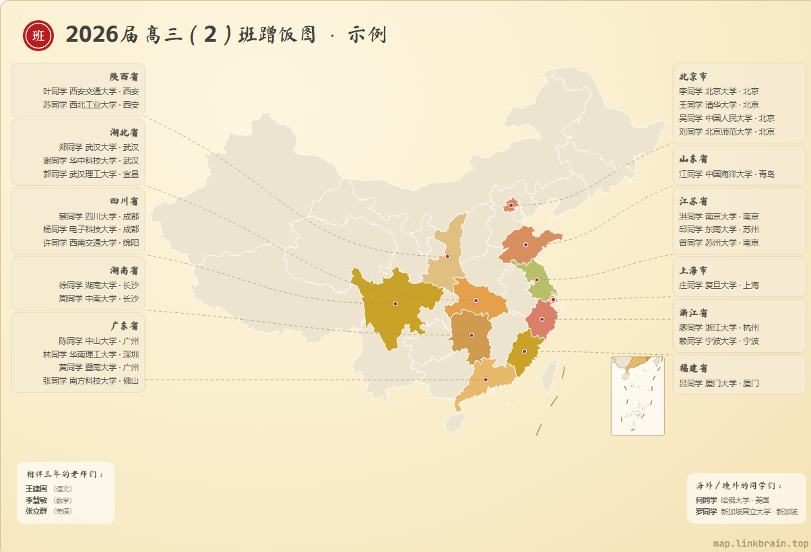
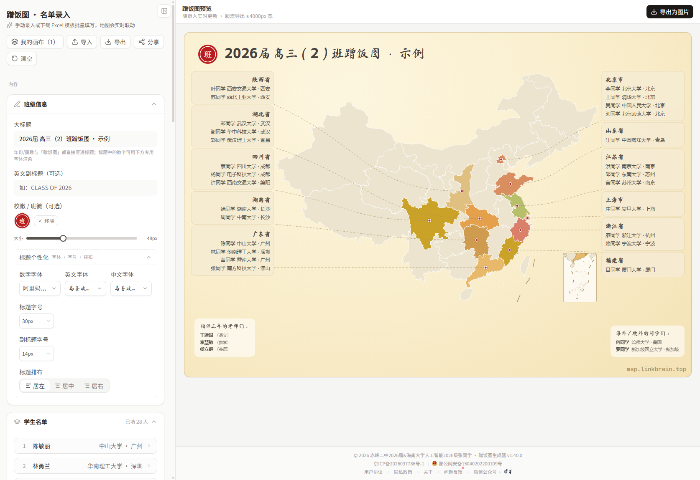
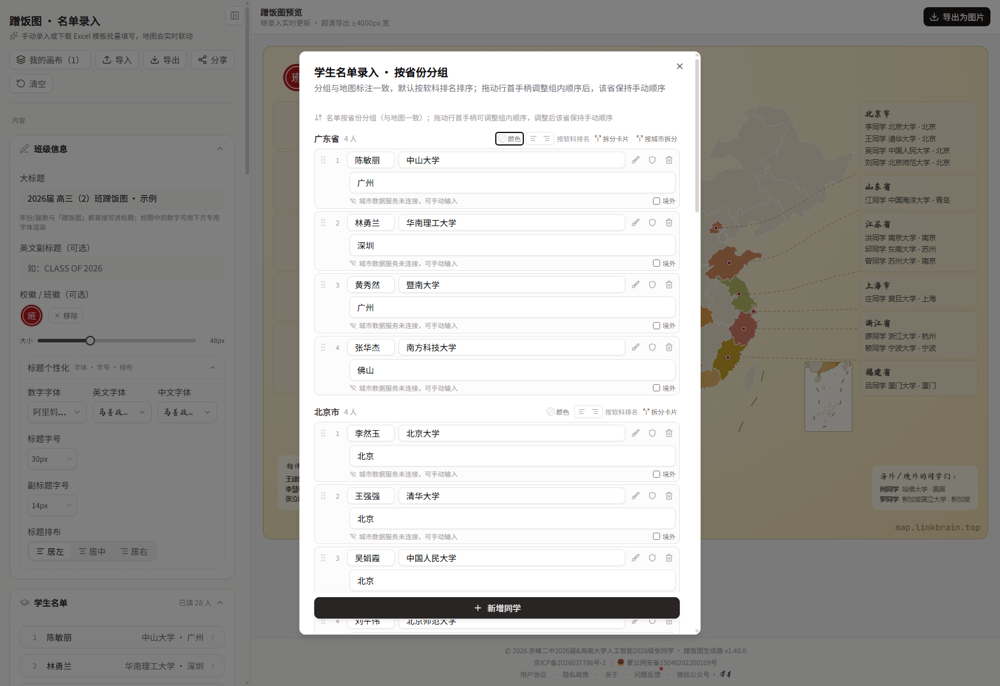
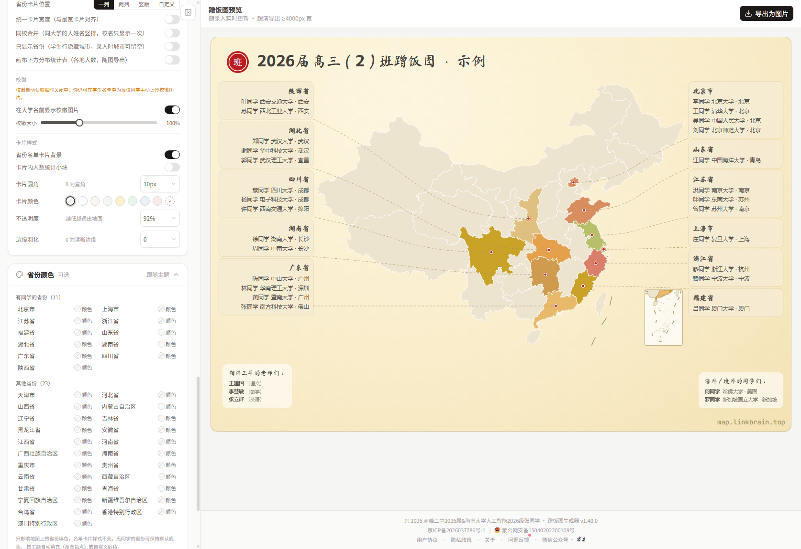
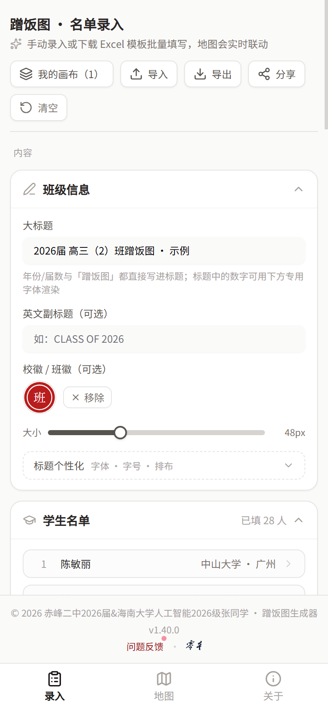
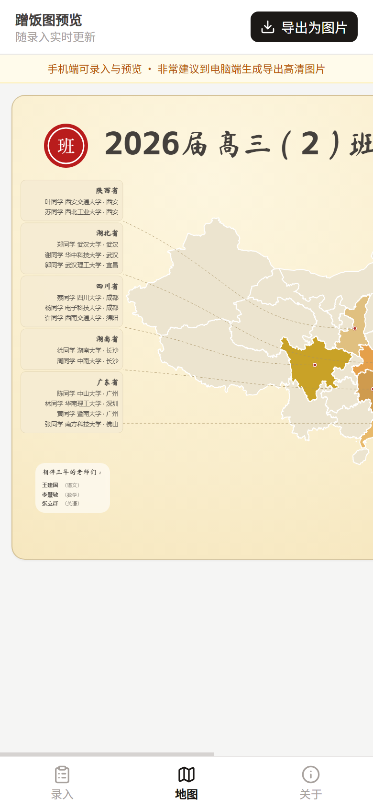

# 蹭饭图生成器

> 聚是一团火，散是满天星。
> 高考结束后，把全班同学的去向画在一张中国地图上——谁去了哪座城市、哪所大学，一目了然。

**在线体验：[map.linkbrain.top](https://map.linkbrain.top)** · 免费使用 · 无需注册 · 数据只存在本机



<p align="center"><sub>▲ 示例数据（姓名已开启「名字一键隐私」，显示为「姓+同学」）</sub></p>

「蹭饭图」是高中毕业季的传统项目：一张中国地图，标注每位同学录取的城市与大学，寓意"以后走到哪儿都有饭蹭"。本工具把这件事做成了网页：**录入名单 → 自动生成高清地图 → 导出图片分享**，全程在浏览器本地完成。

## 文档导航

| 文档 | 内容 |
| --- | --- |
| 📖 [使用教程](docs/user-guide.md) | 三分钟上手、录入技巧、排版设计、导出分享、常见问题 |
| 🛠 [开发文档](docs/development.md) | 架构、目录结构、数据模型、工程化约定、接口与部署 |

## 功能速览

- **录入**：手动录入（响应式，手机可用）· Excel 模板批量导入 · 省/市两级城市选择 · 大学自动推断城市 · 境外同学单独成块 · 老师名单可选
- **排版**：多套主题 + 自定义配色 · 每个省份地图填色可单独定义（含无同学省份三态）· 一列/两列/竖版/自定义四种卡片排布 · 卡片自由拖动 + 画布边界自适应 + 对齐吸附 · 人多可拆卡 · 同校合并
- **个性化**：独立字体字号（含智能推荐）· 上传字体/班徽/毛笔字/校徽 · 卡片圆角透明度羽化 · 装饰文本与图片 · 名字一键隐私
- **导出**：超清 PNG（固定 4000px，不受本机分辨率限制）· 进度可取消 · 微信长按保存引导 · ZIP 全量备份换机迁移
- **隐私**：名单数据只存浏览器 localStorage，不上传服务器

## 界面预览

| 桌面端创建器 | 学生名单录入 |
| --- | --- |
|  |  |

| 省份颜色面板 | 移动端录入 | 移动端地图 |
| --- | --- | --- |
|  |  |  |

## 技术栈

React 19 · TypeScript · Vite 7 · Tailwind CSS · shadcn/ui · 自绘 SVG 地图 · html-to-image · SheetJS · Cloudflare Pages Functions + D1/KV

## 快速开始（开发）

```bash
npm install
npm run dev          # 开发服务器
npm run build:all    # 生产构建（含 /debug 调试产物）
```

详细的构建、部署与工程化约定见 [开发文档](docs/development.md)。

## 数据与版权说明

- 地图为**国家版图示意图**（含南海诸岛及断续线），仅用于标注示意，不代表高校实际校址；使用时请保持地图完整
- 院校排序参考**软科中国大学排名（2025 主榜）**公开榜单，仅用于名单展示顺序，不构成对任何院校的评价
- 校徽著作权归各院校所有，如院校或权利方认为使用不当，请联系我们移除

## 作者与版权

© 2026 赤峰二中2026届 & 海南大学人工智能2026级 张新越

- 网站：[map.linkbrain.top](https://map.linkbrain.top)
- 微信公众号：零本
- 问题反馈：站内「问题反馈」页（一般两天内回复）

## License

[](https://creativecommons.org/licenses/by-nc-sa/4.0/)

本项目采用 **[CC BY-NC-SA 4.0](https://creativecommons.org/licenses/by-nc-sa/4.0/deed.zh-hans)**（知识共享 署名—非商业性使用—相同方式共享 4.0 国际）许可协议：

- **署名** — 须注明原作者（赤峰二中2026届 & 海南大学人工智能2026级 张新越）及来源链接；
- **非商业性使用** — 不得用于任何商业目的；
- **相同方式共享** — 二次作品须以同一协议发布。

详见 [LICENSE](LICENSE)。商用授权请单独联系作者。
